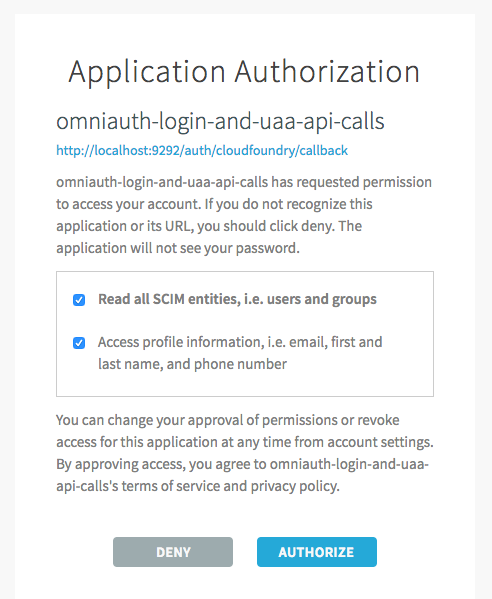

# Ruby OmniAuth - Simple Login Only

First, add `uaa-deployment` into the `$PATH` and setup `$UAA_URL`/`$UAA_CA_CERT`:

```text
source <(path/to/uaa-deployment/bin/uaa-deployment env)
uaa-deployment auth-client
```

Create a UAA client that includes only `openid` (we will add `scim.read` later):

```text
uaa create-client omniauth-login-and-uaa-api-calls -s omniauth-login-and-uaa-api-calls \
  --authorized_grant_types authorization_code,refresh_token \
  --scope openid \
  --redirect_uri http://localhost:9292/auth/cloudfoundry/callback,http://127.0.0.1:9292/auth/cloudfoundry/callback
```

Create a demo user with only `openid` scope:

```text
uaa create-user viewer-of-users \
  --password viewer-of-users \
  --email viewer-of-users@example.com \
  --givenName "Viewer" \
  --familyName "Users"
```

Next, run the app:

```text
bundle
bundle exec rackup
```

Visit https://localhost:9292 and commence the login sequence as user `viewer-of-users`. You will be redirected to the UAA, and ultimately returned to the app.

The home page will show "viewer-of-users@example.com ( openid )", where `openid` is the only UAA scope available to the user. It is both the only scope for the user and the only scope for the application.

The "List Users" code in Ruby is:

```ruby
token_info = issuer.refresh_token_grant(session[:refresh_token])
scim = CF::UAA::Scim.new(ENV['UAA_URL'], token_info.auth_header, options)
scim.query(:user).to_json
```

If you click "List Users", you will see a UAA client error returned:

```json
{
    "error":"insufficient_scope",
    "error_description":"Insufficient scope for this resource",
    "scope":"uaa.admin scim.read zones.uaa.admin",
    "authorized_scopes":"openid"
}
```

We need our authenticated user to have one of these three scopes to perform the "List Users" API call upon the UAA.

First, add user `viewer-of-users` to group `scim.read`:

```text
uaa add-member scim.read viewer-of-users
```

Log out and log back in. The home page will still show "viewer-of-users@example.com ( openid )" instead of "viewer-of-users@example.com ( openid scim.read )", because the application's client `omniauth-login-and-uaa-api-calls` is only configured with `openid`. We are seeing the intersection of the user's groups and the client's scopes.

Add `scim.read` scope to the client:

```text
uaa update-client omniauth-login-and-uaa-api-calls \
  --scope openid,scim.read
```

Log out and log back in. The user will be asked to authorize an expanded scope of access to their account:



After clicking "Authorize", the application's home page will show that the available scopes are now "viewer-of-users@example.com ( openid scim.read )".

Next remove `scim.read` scope from client:

```text
uaa update-client omniauth-login-and-uaa-api-calls \
  --scope openid
```

The `/users` page will error with:

```json
{
    "error":"invalid_token",
    "error_description":"Some scopes have been revoked: scim.read",
    "authorized_scopes":"openid scim.read"
}
```

Logout again - so that the application's tokens forget what `authorized_scopes` they previously received, and log back in. The "List Users" page will now show the original authorization error:

```json
{
    "error":"insufficient_scope",
    "error_description":"Insufficient scope for this resource",
    "scope":"uaa.admin scim.read zones.uaa.admin",
    "authorized_scopes":"openid"
}
```