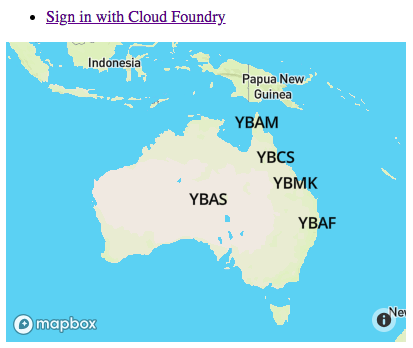
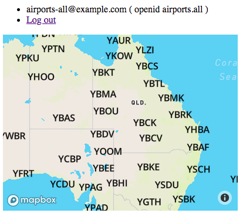

# View Airports on a map

The airport data comes from the backend Airports API (`resource-server`). The number of results and the attributes for each airport are determined by the User's UAA scopes.

The Airports API (`resource-server`) is now a backend application - only accessed by this wrapper application.

The User logins to the UAA via redirection from this web app, and its requests for map data (geojson features) are first forwarded to the backend application with the UAA access token. The resource server determines what airports and attributes the user can see. This application then views those airports.

Setup $UAA_URL/$UAA_CA_CERT

```text
source <(path/to/uaa-deployment/bin/uaa-deployment env)
```

Create UAA client:

```text
uaa create-client airports-map -s airports-map \
  --authorized_grant_types authorization_code,refresh_token \
  --scope openid,airports-50,airports-all \
  --redirect_uri http://localhost:9393/auth/cloudfoundry/callback
```

Run as :9393 (assuming backend airports app on :9292)

```text
bundle exec shotgun -p 9393
```

Visit the site as a guest to see a maximum of 10 airports (zoom in to see more):



Login as `airports-all` user to see all the airports (zoom in to see more):

